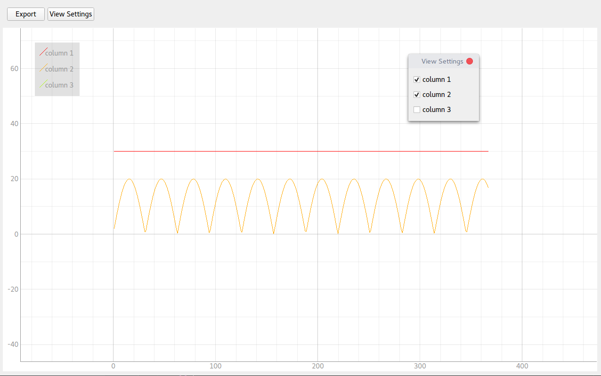

## Чтение и вывод данных от МК через последовательный порт

### read_to_csv.py
Чтение данных из последовательного порта в csv файл.

\* требует только pyserial

### serial_plotter.py
Живой вывод графиков (возможно нескольких)

\* требует, qt, pyqtgraph, numpy и pyserial

### Ограничения  

- Строки разделены переносом `\r\n`
- Значения в строке разделены `;`
- Временная метка находится в первой колонке
- Количество колонок не изменяется в ходе работы программы

### Запуск

python3.6  
numpy, pyserial, pyqtgraph

pip3.6 install -r requirements.txt
